## WW-myHOME - BME-Shield

### Funktion
Universelle Wetterkappe für die Luftdruck-Sensormodule BME280 oder BMP280

### Details
- Der ursprüngliche Entwurf der Wetterkappe stammt von Dr. Eugen Stall - siehe hier:
  - https://www.stall.biz/produkt/wetterkappe-fuer-den-weatherman-neues-layout

- Basierend auf dieser Grundlage wurde die Wetterkappe neu konstruiert und in einigen Punkten modifiziert und erweitert:
   - Vergrösserung der Sensorkammer
   - Erweiterung der Gehäuselüftung für die Sensorkammer
   - (verschiedene) Adapter zur Aufnahme des Sensors
   - eindeutige Fixierung der Kabelzuführung
   - zusätzliche Lüftungskappen (einfach / erweitert) zur geschützten Entlüftung der Sensorkammer

### BME-Shield - Version 1.1

#### BME-Shield V 1.1 - Konstruktion
- Passiv belüftete Wetterkappe

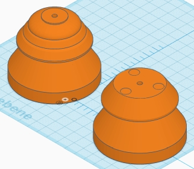
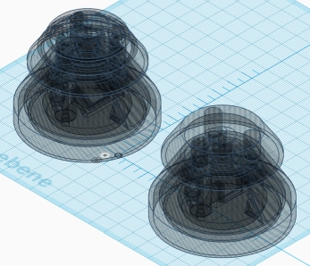
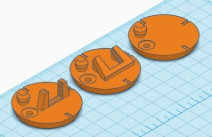
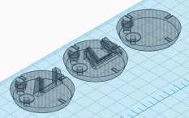

#### BME-Shield V 1.1 - 3D-Druck - Details

- Sensorkammer V1.0 mit Lüftungskappen und Sensor-Adapter:

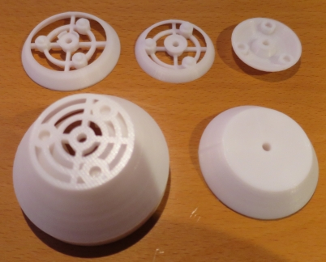
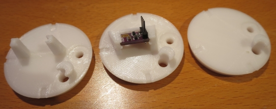

Beispiel der Kabelfixierung und des Sensor-Adapters (senkrecht):

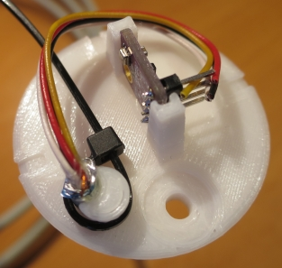

Beispiel der Kabelfixierung und des Sensor-Adapters (geneigt):

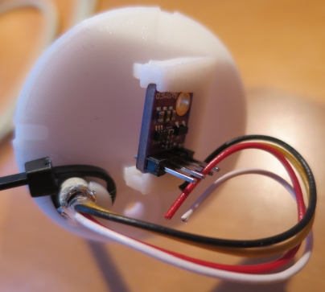

Sensorkammer V1.0 und Sensor-Adapter (geneigt):

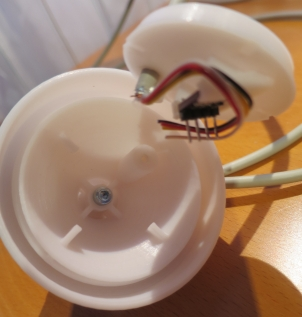

Sensorkammer V1.0 unten (geschlossen):

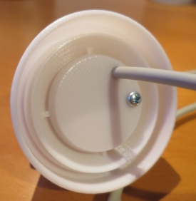

#### BME-Shield V 1.1 - 3D-Druck

BME-Shield V1.0 (einfach):

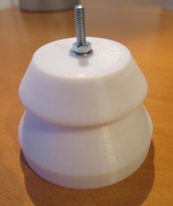

BME-Shield V1.0 (erweitert):

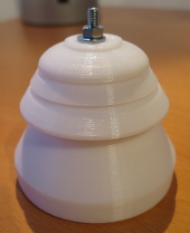

Wurde im Herbst und Winter 2018/2019 erfolgreich getestet:

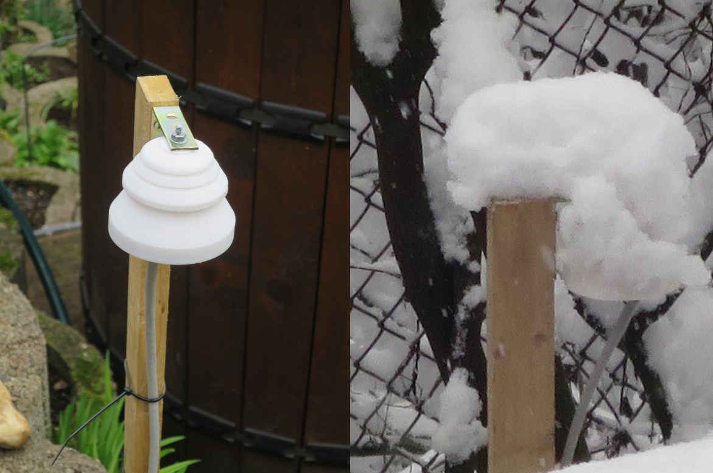

#### Montagematerial:
- 1 BME280
- 1 PTFE Druckausgleich-Membran Ø10,2/5,5 VPE
- 1 Blechschraube 3,5 x 13
- 1 Zylinderschraube >= 4 x 35 + Unterlegscheibe mit Mutter 4 mm
- Kabelbinder 2,5 mm

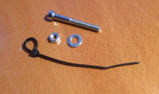

### BME-Shield - Version 2.0

#### BME-Shield V 2.0 - Konstruktion

- Aufwändig konstruierte Wetterkappe - einsetzbar mit oder ohne Lüfter

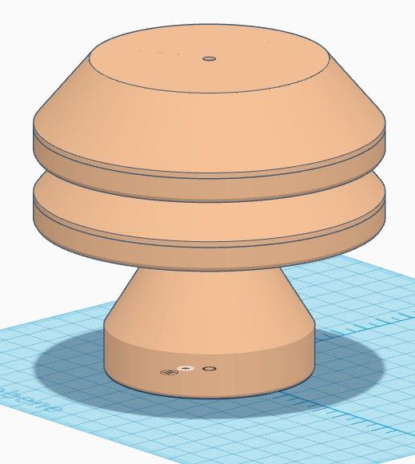
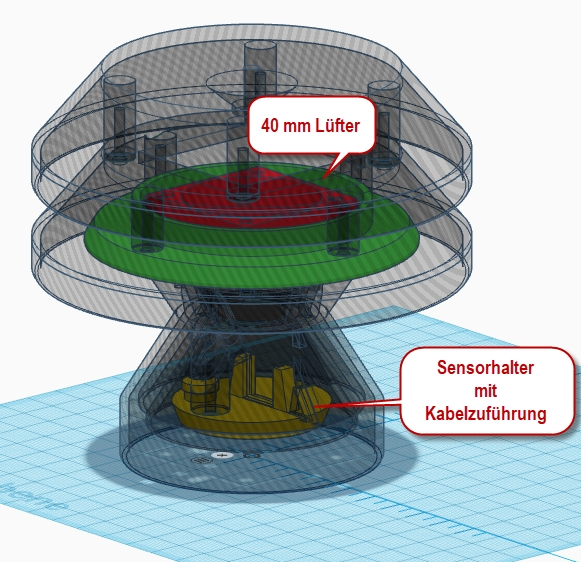
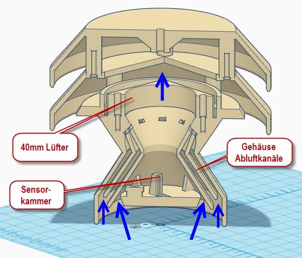

- Befindet sich z.Z. in der Erprobung - momentan (Frühjahr 2019) sind die Lüfter deaktiviert, um die 'grundsätzliche' Funktionsfähigkeit des BME-Shields zu testen (hier die Fragestellung: funktioniert der Kamineffekt auch ohne Lüftereinsatz ...)

#### BME-Shield V 2.0 - 3D-Druck

Übersicht der 3D-Druckteile

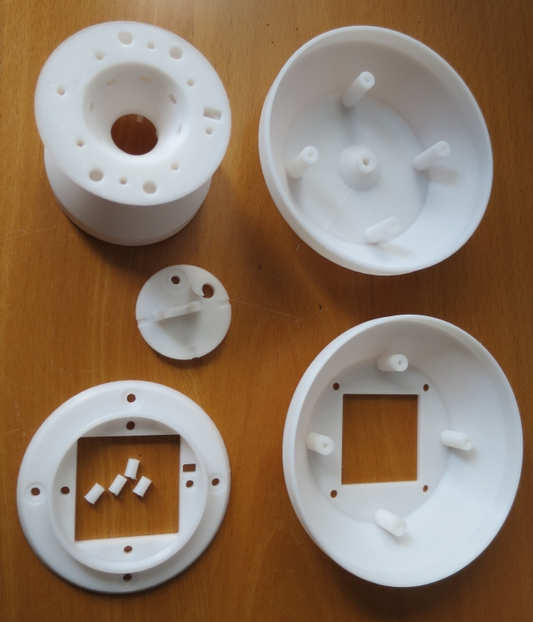

Montage der Lüfterplatte mit Fixierbolzen (können auch weggelassen werden) und mit 4 Blechschrauben (Rundkopf 3,5x13mm):

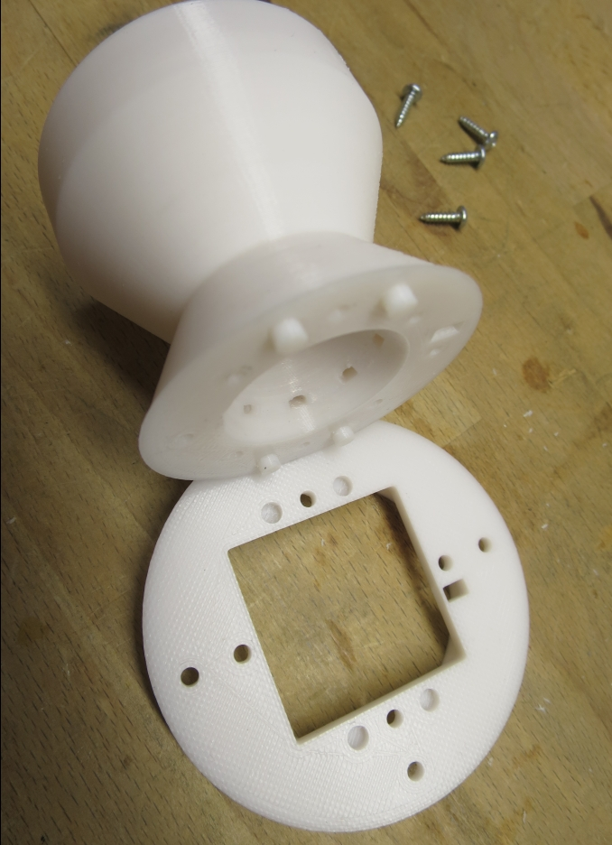

Vormontage der Kabelfixierung und des Sensor-Adapters mit Membranhalter (Kabel: JY(St)Y 4x2x0,6) - auf der Weatherman-Seite wird das +5V und das Masse-Kabel direkt an den 5V Eingang / Masse angeschlossen:

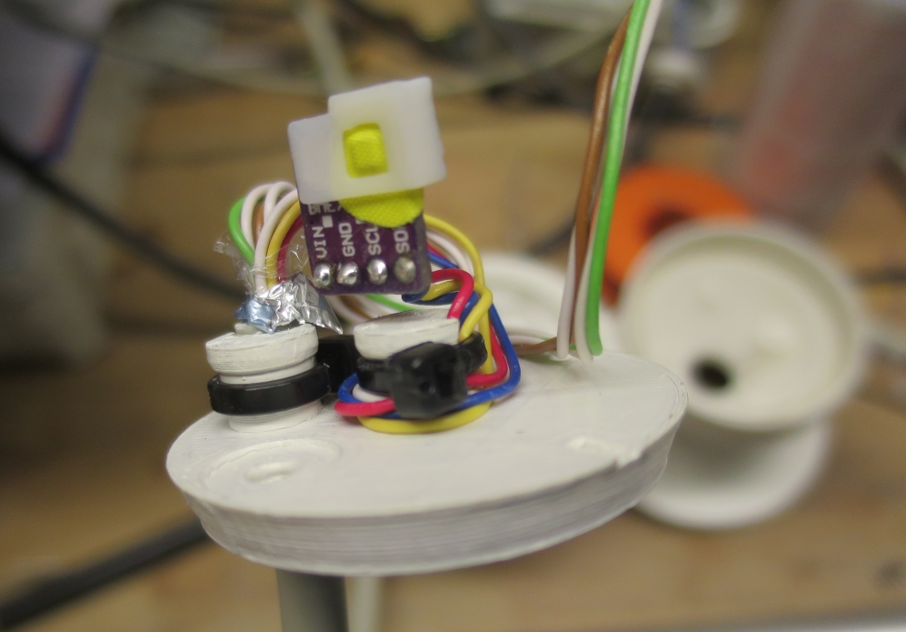

Montage der Sensorplatine und Durchleitung der Stromversorgungsdrähte für den Lüfter - dabei sollte die Sensorplatine richtig positioniert sein - mittig, unten, keine Wandberührung - fixiert wird der Träger mit einer einzelnen Blechschraube (Rundkopf 3,5x13mm):

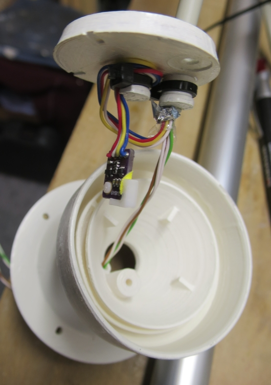
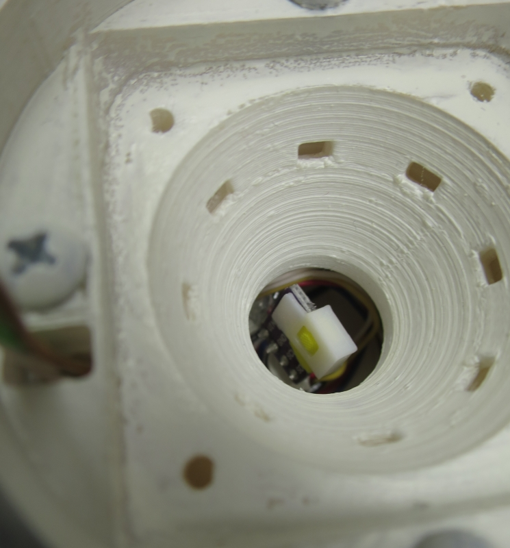
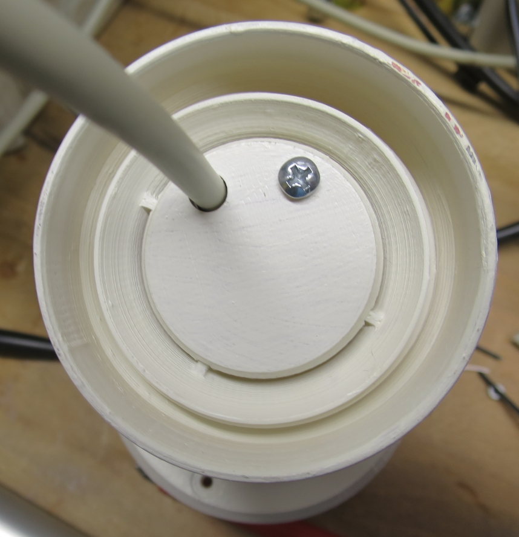

Montage des Lüfters mit 4 Blechschrauben (Rundkopf 3,5x19mm) und Unterlegscheiben - wahlweise kann (für Testzwecke) im Rand auch ein Ein/Aus Mikroschalter verbaut werden:

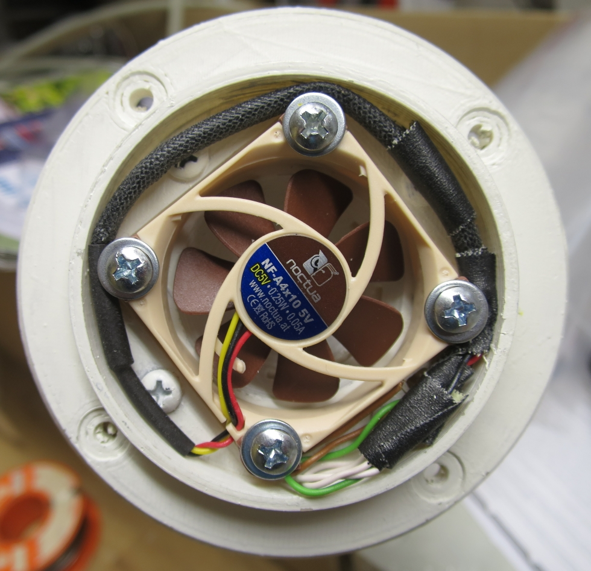

Zusammenbau der beiden Deckkappen mit 4 Blechschrauben (Rundkopf 3,5x13mm) - Deckkappen hier mit Alu-Reflexionsschutz - und Vormontage der Halterungsschraube in der obersten Kappe:

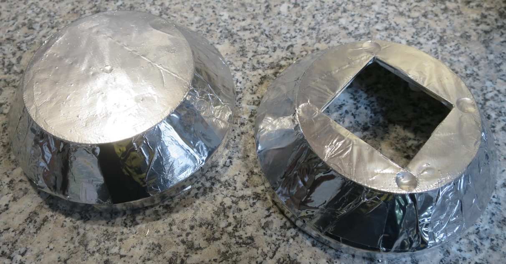

Montage der beiden Kappen und der Sensoreinheit mit 4 Blechschrauben (Rundkopf 3,5x13mm):

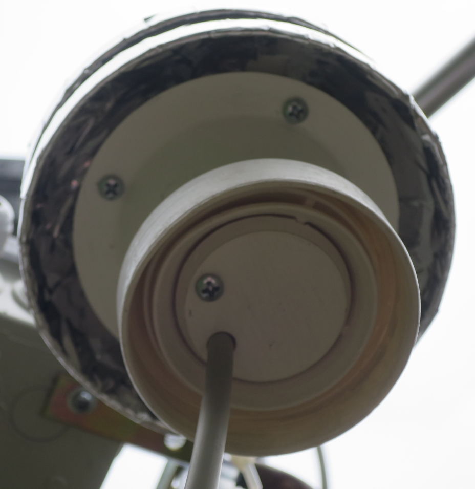

#### Montagematerial:
- 1 BME280
- 1 PTFE Druckausgleich-Membran Ø10,2/5,5 VPE
- 1 40mm Lüfter NOCTUA NF-A4x10 5V
- evtl. 1 Ein/Aus Mikroschalter
- Kabel JY(St)Y 4x2x0,6 (Kupferadern)
- 13 Blechschrauben 3,5 x 13
- 4 Blechschrauben 3,5 x 19 und 4 Unterlegscheiben
- Zylinderschraube >= 4 x 35 + Unterlegscheibe mit Mutter 4 mm
- Kabelbinder 2,5 mm

### BME-Shield - Sonstiges

#### Tipps:
- Natürlich sollten alle 3D-Druckteile mit einem weissen UV-beständigen Acryl-Lack überzogen werden. Man kann natürlich Sprühlack einsetzen - aber: im Innenbereich nicht einsetzbar !! Gute Erfahrungen habe ich mit lösungsmittelfreien Streichlack gemacht - läßt sich mit einem kleinen Pinsel super verarbeiten ... und riecht (fast) nicht:

   400 ml&nbsp;&nbsp;&nbsp;&nbsp;&nbsp;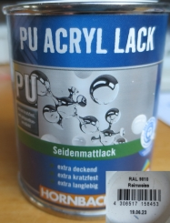 125 ml

- Die Sensorplatine des BME280 vorsichtig mit Hilfe eines kleinen Pinsels mit 'Plastik&nbsp;70' bestreichen (den Sensor aussparen !!).

- Sensor mit PTFE Druckausgleichsmembran MITTIG abdecken

  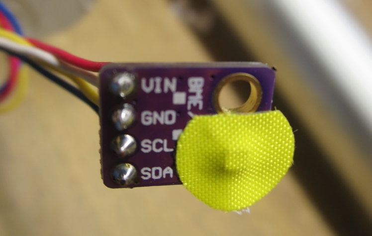

- Membranhalter auf Platine wie im Bild gezeigt positionieren (STL 3D-Druckfile liegt im BIN-Verzeichnis) - dann die überstehenden Folienseiten um die Platine klappen und den Halter nach rechts über die Platinenkante drehen

  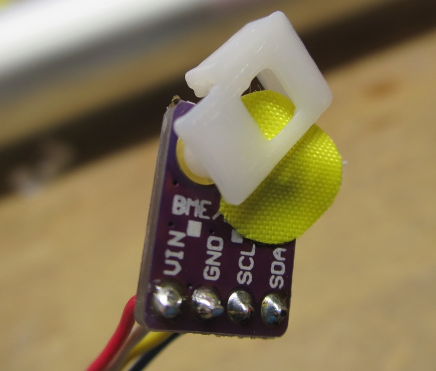

- Membranhalter bündig fixieren (Halter auf Platine drücken), sodass die Membran faltenfrei aufliegt:

  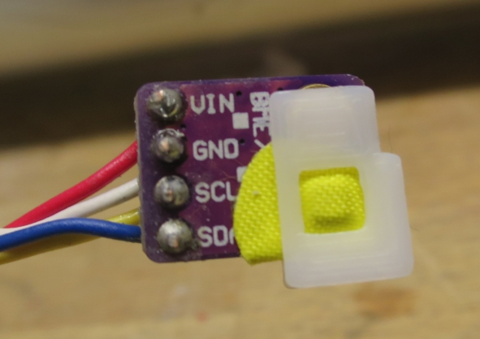

- Bei der Endmontage des Sensorträgers dafür sorgen, dass die Kabel in der Sensorkammer nicht die Seitenwände berühren (Feuchtigkeitsbrücke).
- Evtl. beim Zusammenbau mit etwas Silikon sicherstellen, dass keine Feuchtigkeit über die zentrale Mutter von oben in das Gehäuse kommen kann.

#### BME280 Modul, PTFE-Druckausgleichsmembran, NOCTUA Lüfter:

- Siehe hier:

  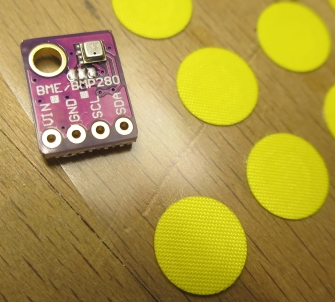

- BME280
  - https://www.az-delivery.de/search?type=article%2Cpage%2Cproduct&q=bme280*&ls=de

- PTFE Druckausgleich-Membran Ø10,2/5,5 VPE
  - https://shop.bb-sensors.com/Messtechnik-je-Branche/Automotive/Druckausgleich-Membran-10-2-5-5-VPE-12-Stueck.html

- NOCTUA NF-A4x10 5V
  - https://noctua.at/de/products/fan/nf-a4x10-5v

### Version

2.0 - 2018-05-10
 - Neue erweiterte Version

1.1 - 2018-12-22
 - Erhöhung der Spritzschuzkanten bei Sensorkammer und Deckeln

1.0 - 2018-12-19
 - Erstausgabe
