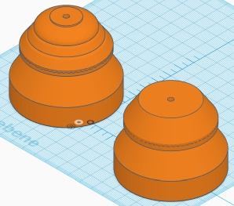

## WW-myHOME - BME-Shield

### Funktion
Universelle Wetterkappe für die Luftdruck-Sensormodule BME280 oder BMP280

### Details
- Der ürsprüngliche Entwurf der Wetterkappe stammt von Dr. Eugen Stall - siehe hier:
  - https://www.stall.biz/produkt/wetterkappe-fuer-den-weatherman-neues-layout

- Basierend auf der Grundlage wurde die Wetterkappe neu konstruiert und in einigen Punkten modifiziert und erweitert:
- Erhöhung der Wandstärken (auf 2 mm)
- Erweiterung der Gehäuselüftung für die Sensorkammer
- (verschiedene) Adapter zur Aufnahme des Sensors
- eindeutige Fixierung der Kabelzuführung
- zusätzliche Lüftungskappen (einfach / erweitert) zur geschützten Entlüftung der Sensorkammer

### BME-Shield - Übersicht

### BME-Shield - xxx

### Version

1.0.0.0 - 2018-12-19
- Erstausgabe
