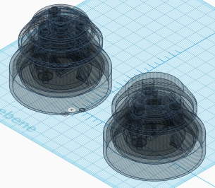

## WW-myHOME - BME-Shield

### Funktion
Universelle Wetterkappe für die Luftdruck-Sensormodule BME280 oder BMP280

### Details
- Der ursprüngliche Entwurf der Wetterkappe stammt von Dr. Eugen Stall - siehe hier:
  - https://www.stall.biz/produkt/wetterkappe-fuer-den-weatherman-neues-layout

- Basierend auf dieser Grundlage wurde die Wetterkappe neu konstruiert und in einigen Punkten modifiziert und erweitert:
   - Vergrösserung der Sensorkammer
   - Erweiterung der Gehäuselüftung für die Sensorkammer
   - (verschiedene) Adapter zur Aufnahme des Sensors
   - eindeutige Fixierung der Kabelzuführung
   - zusätzliche Lüftungskappen (einfach / erweitert) zur geschützten Entlüftung der Sensorkammer

### BME-Shield - Übersicht

Konstruktion V1.1 :

### BME-Shield - 3D-Druck

BME-Shield V1.0 (einfach):

BME-Shield V1.0 (erweitert):

### BME-Shield - 3D-Druck - Details

Sensorkammer V1.0 mit Lüftungskappen und Sensor-Adapter:

Beispiel der Kabelfixierung und Sensor-Adapter (senkrecht):

Beispiel der Kabelfixierung und Sensor-Adapter (geneigt):

Sensorkammer V1.0 und Sensor-Adapter (geneigt):

Sensorkammer V1.0 unten (geschlossen):

### BME-Shield - Sonstiges

Tipps:
- Die Sensorplatine vorsichtig mit Hilfe eines kleinen Pinsels mit 'Plastik 70' bestreichen (den Sensor aussparen !!).
- Bei der Endmontage des Sensorträgers dafür sorgen, dass die Kabel in der Sensorkammer nicht die Seitenwände berühren (Feuchtigkeitsbrücke).
- Evtl. beim Zusammenbau mit etwas Silikon sicherstellen, dass keine Feuchtigkeit über die zentrale Mutter von oben in das Gehäuse kommen kann.

- Z.Z. (12-2018) läuft ein Testbetrieb des erweiterten BME-Shields an einem ESPEasy WEMOS ...

BME280 Modul:

Siehe hier: https://www.az-delivery.de/search?type=article%2Cpage%2Cproduct&q=bme280*&ls=de

Montagematerial:
- Blechschraube 3,5 x 13
- Zylinderschraube 4 x 35 + Unterlegscheibe mit Mutter 4 mm
- Kabelbinder 2,5 mm

### Version

1.1 - 2018-12-22
 - Erhöhung der Spritzschuzkanten bei Sensorkammer und Deckeln

1.0 - 2018-12-19
 - Erstausgabe
